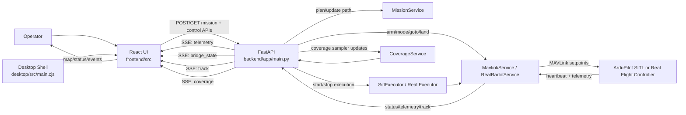
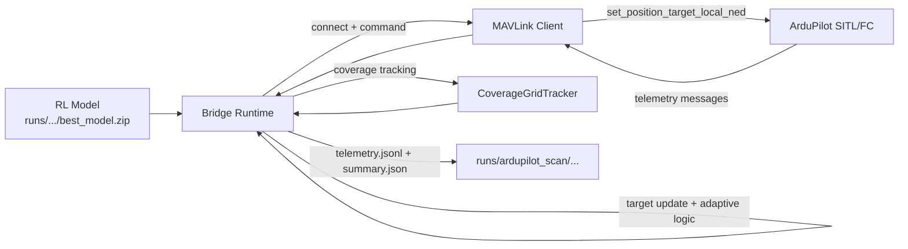

# System Data Flow Loop

This diagram is derived from the runtime paths in:
- `frontend/src/App.jsx`
- `frontend/src/MapPanel.jsx`
- `frontend/src/pages/RealTest.jsx`
- `backend/app/main.py`
- `backend/app/sitl_executor.py`
- `backend/app/mavlink_service.py`
- `scripts/bridge/runtime.py`

## 1) Mission Operations Loop (Sim + Real)

Main loop closure:
1. User action in UI triggers backend mission/control endpoint.
2. Backend sends MAVLink commands to SITL/real vehicle.
3. Vehicle returns telemetry and heartbeat.
4. Backend pushes SSE updates (`telemetry`, `bridge_state`, `track`, `coverage`) back to UI.
5. User adjusts mission/controls from updated state, repeating the loop.

## 2) RL Bridge Runtime Loop (`scripts/bridge/runtime.py`)

